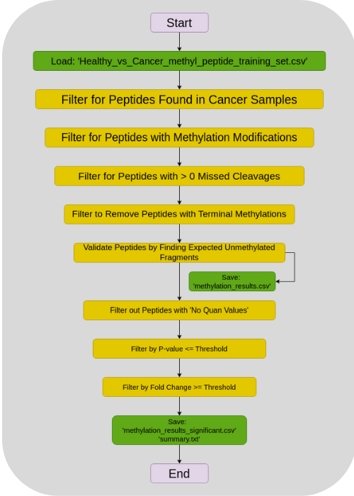
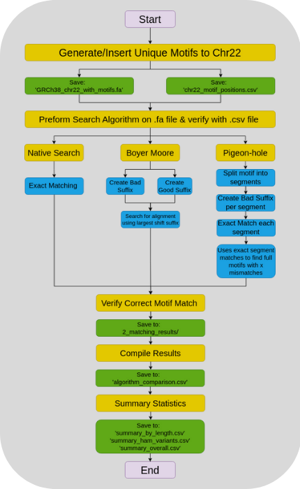
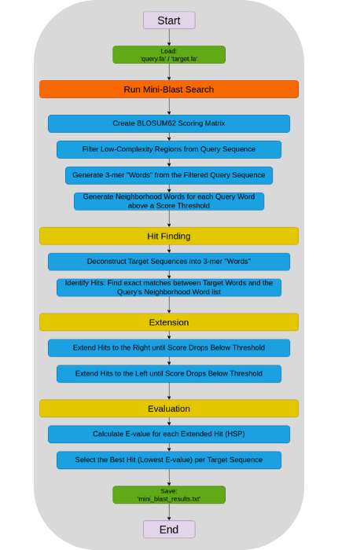

# MMB5009 Bioinformatics Assignment

This repository contains the implementation of five bioinformatics tasks for the MMB5009 study unit at the University of Malta.

## Installation

Create and activate the conda environment using the provided environment file:

```bash
git clone git@github.com:eblake90/MMB5009_Assignment_Edward-Blake.git
cd MMB5009_Assignment_Edward-Blake/
conda env create -f mmb5009_conda_env.yml
conda activate mmb5009_edward
```

## Directory Structure

```
~/MMB5009_Assignment_Edward-Blake/
├── mmb5009_conda_env.yml          # Conda environment specification
├── MMB5009_Bioinformatics_Assignment.pdf    # Assignment specification
├── README.md
├── 1_Proteomics_Methylation_Analysis/      # Task 1 scripts
│   ├── methylation_analysis.py
│   └── data/
├── 2_Protein_Dataset_Generation/           # Task 2 scripts
│   ├── 0_sampler.py
│   ├── 1_extract_accessions.py
│   ├── 2_protein_accessions_downloader.py
│   └── data/
├── 3_Matching_Algorithms/            # Task 3 scripts
│   ├── run_matching_algorithms.sh
│   ├── scripts/
│   │   ├── 0_dna_sequence_generator.py
│   │   ├── 1_naive_matching.py
│   │   ├── 2_boyer_moore_matching.py
│   │   ├── 3_pigeon_hole_matching.py
│   │   ├── 4_compile_results.py
│   │   └── 5_summary_stats.py
│   └── data/
├── 4_mini-blast/                           # Task 4 scripts
│   ├── run_mini_blast.py
│   └── data/
└── 5_RNA-Seq_Analysis/                     # Task 5 scripts
    ├── run_rna_seq_pipeline.sh
    ├── scripts/
    │   ├── 0_fastq_downloader.py
    │   ├── 1_QC.sh
    │   ├── 2_adapter_trimming.sh
    │   ├── 3_star_alignment.sh
    │   ├── 4_download_annotations.sh
    │   ├── 5_gene_coverage.sh
    │   └── 6_normalise_expression.py
    └── data/
```

---
---

## Task 1: Methylation Identification and Visualization

Analyzes protein methylation patterns in cancer vs healthy samples from mass spectrometry data.

<h3 align="center">Flowchart of Task 1</h3>
<p align="center">
  
</p>

### Prerequisites
- Input file `Healthy_vs_Cancer_methyl_peptide_training_set.csv` should be in `data/`

### Directory Structure

```
1_Proteomics_Methylation_Analysis/
└── data/
    ├── Healthy_vs_Cancer_methyl_peptide_training_set.csv
    ├── methylation_results.csv
    ├── methylation_results_significant.csv
    └── summary.txt
```

### Running the Analysis

```bash
cd 1_Proteomics_Methylation_Analysis/
python methylation_analysis.py \
  --input_file data/Healthy_vs_Cancer_methyl_peptide_training_set.csv \
  --output_dir data \
  --p_value_threshold 0.05 \
  --fold_change_threshold 1.5
```

### Parameters (all optional with defaults):
- `--input_file`: Path to input CSV file (default: `data/Healthy_vs_Cancer_methyl_peptide_training_set.csv`)
- `--output_dir`: Output directory for results (default: `data/`)
- `--p_value_threshold`: P-value threshold for statistical significance (default: 0.05)
- `--fold_change_threshold`: Fold change threshold for differential methylation (default: 1.5)

### Results
- `methylation_results.csv` - All validated methylated peptides
- `methylation_results_significant.csv` - Statistically significant methylated peptides
- `summary.txt` - Analysis summary with peptide counts and categories

---
---

## Task 2: Protein Dataset Generation

Retrieves comprehensive protein annotations from UniProt for methylation candidate proteins.

<h3 align="center">Flowchart of Task 2</h3>
<p align="center">
  
</p>

### Prerequisites
- Requires completion of Task 1 (uses `methylation_results_significant.csv`)

### Directory Structure

```
1_Proteomics_Methylation_Analysis/
├── data/
│   └── methylation_results_significant.csv (from Task 1)
2_Protein_Dataset_Generation/
└── data/
    ├── 0_P84243_sample.json
    ├── 1_accessions_input.csv
    └── 2_protein_dataset.json

```

### Running the Pipeline

```bash
cd ..
cd 2_Protein_Dataset_Generation/

# Step 1: Extract protein accessions from Task 1 results
python 1_extract_accessions.py \
  --input_file ../1_Proteomics_Methylation_Analysis/data/methylation_results_significant.csv \
  --output_file data/1_accessions_input.csv

# Step 2: Download protein data from UniProt
python 2_protein_accessions_downloader.py \
  --input data/1_accessions_input.csv \
  --output data/2_protein_dataset.json
```

### Parameters (all optional with defaults):

#### 1_extract_accessions.py:
- `--input_file`: Input CSV file with methylation data (default: `../1_Proteomics_Methylation_Analysis/data/methylation_results_significant.csv`)
- `--output_file`: Output CSV file for accessions (default: `data/1_accessions_input.csv`)

#### 2_protein_accessions_downloader.py:
- `--input`: Input CSV file with protein accessions (default: `/data/1_accessions_input.csv`)
- `--output`: Output JSON file (default: `/data/2_protein_dataset.json`)

### Results
- `1_accessions_input.csv` - Extracted protein accessions
- `2_protein_dataset.json` - Comprehensive protein annotations including:
  - Protein names, gene symbols, organism information
  - Gene Ontology terms, disease associations
  - Protein families, domains, and sequence variants

### Note
- `0_sampler.py` - Simple sampler script used for visualising the structure of a typical .json file.

---
---

## Task 3: Matching Algorithms

Implements and compares naive, Boyer-Moore, and pigeon-hole string matching algorithms on DNA sequences.

<h3 align="center">Flowchart of Task 3</h3>
<p align="center">
  
</p>


### Prerequisites
- Active internet connection required for GRCh38_chr22.fa download.

### Directory Structure

```
3_Matching_Algorithms/
└── data/
    ├── 1_dna_sequence_data/
    │   ├── GRCh38_chr22.fa
    │   ├── GRCh38_chr22_with_motifs.fa
    │   └── chr22_motif_positions.csv
    ├── 2_matching_results/
    │   ├── naive_search_results.csv
    │   ├── boyer_moore_search_results.csv
    │   ├── pigeon_hole_search_results_max-mismatch-0.csv
    │   ├── pigeon_hole_search_results_max-mismatch-1.csv
    │   ├── pigeon_hole_search_results_max-mismatch-2.csv
    │   ├── pigeon_hole_search_results_max-mismatch-3.csv
    │   ├── pigeon_hole_search_results_max-mismatch-4.csv
    │   └── pigeon_hole_search_results_max-mismatch-5.csv
    └── 3_result_analysis/
        ├── algorithm_comparison.csv
        ├── summary_overall.csv
        ├── summary_ham_variants.csv
        └── summary_by_length.csv
```

### Running the Complete Pipeline

```bash
cd ..
cd 3_Matching_Algorithms/
chmod +x run_matching_algorithms.sh
./run_matching_algorithms.sh \
  data \
  42 \
  "15,50,120" \
  20 \
  5
```

#### Parameters (all optional with defaults):

```bash
./run_matching_algorithms.sh [data_dir] [seed] [motif_lengths] [families_per_length] [max_k]
```

- `data_dir`: Base data directory (default: `data`)
- `seed`: Random seed for reproducibility (default: `42`)
- `motif_lengths`: Comma-separated motif lengths (default: `"15,50,120"`)
- `families_per_length`: Number of families per length (default: `20`)
- `max_k`: Maximum Hamming-distance mutants (default: `5`)

#### Note:
The script automatically creates subdirectories:

- `{data_dir}/1_dna_sequence_data/` - Generated DNA sequences and motif positions
- `{data_dir}/2_matching_results/` - Algorithm search results
- `{data_dir}/3_result_analysis/` - Performance comparisons and statistics

### Manual Execution (Optional)

The master script runs all components automatically, but individual steps can be run manually:

```bash
# Generate DNA sequence with synthetic motifs
python scripts/0_dna_sequence_generator.py \
  --output_dir "data" \
  --seed 42 \
  --motif_lengths 15,50,120 \
  --families_per_length 2 \
  --max_k 2

# Run individual matching algorithms
python scripts/1_naive_matching.py \
  --input_fasta "data/1_dna_sequence_data/GRCh38_chr22_with_motifs.fa" \
  --motif_positions "data/1_dna_sequence_data/chr22_motif_positions.csv" \
  --output_csv "data/2_matching_results/naive_search_results.csv"

python scripts/2_boyer_moore_matching.py \
  --input_fasta "data/1_dna_sequence_data/GRCh38_chr22_with_motifs.fa" \
  --motif_positions "data/1_dna_sequence_data/chr22_motif_positions.csv" \
  --output_csv "data/2_matching_results/boyer_moore_search_results.csv"

python scripts/3_pigeon_hole_matching.py \
  --input_fasta "data/1_dna_sequence_data/GRCh38_chr22_with_motifs.fa" \
  --motif_positions "data/1_dna_sequence_data/chr22_motif_positions.csv" \
  --output_dir "data/2_matching_results" \
  --max_mismatches 2

# Compile results
python scripts/4_compile_results.py \
  --naive_results "data/2_matching_results/naive_search_results.csv" \
  --boyer_moore_results "data/2_matching_results/boyer_moore_search_results.csv" \
  --pigeon_hole_dir "data/2_matching_results" \
  --output_file "data/3_result_analysis/algorithm_comparison.csv" \
  --max_mismatch_level 2

python scripts/5_summary_stats.py \
  --input_file "data/3_result_analysis/algorithm_comparison.csv" \
  --output_dir "data/3_result_analysis"  \
  --max_mismatch_level 2
```

### Results
- `data/1_dna_sequence_data/` - Generated chromosome 22 with synthetic motifs
- `data/2_matching_results/` - Algorithm search results for each method
- `data/3_result_analysis/` - Comparative analysis and summary statistics

---
---

## Task 4: Mini-BLAST Implementation

Implements a simplified BLAST algorithm for protein sequence similarity searching.

<h3 align="center">Flowchart of Task 4</h3>
<p align="center">
  
</p>

### Prerequisites
- Query sequence in `data/input/query.fa`
- Target sequences in `data/input/target.fa`

### Directory Structure
```
4_mini-blast/
└── data/
    ├── input/
    │   ├── query.fa
    │   └── target.fa
    └── output/
        └── mini_blast_results.txt
```


### Running Mini-BLAST

```bash
cd ..
cd 4_Mini-Blast/
python run_mini_blast.py \
  --query_file data/input/query.fa \
  --target_file data/input/target.fa \
  --output_file data/output/mini_blast_results.txt \
  --threshold_score 11 \
  --neighborhood_threshold 13
```

### Parameters (all optional with defaults):
- `--query_file`: Input FASTA file containing query protein sequence (default: `data/input/query.fa`)
- `--target_file`: Input FASTA file containing target protein sequences (default: `data/input/target.fa`)
- `--output_file`: Output file path for alignment results (default: `data/output/mini_blast_results.txt`)
- `--threshold_score`: Threshold score for extending hits (default: `11`)
- `--neighborhood_threshold`: Threshold for neighborhood word scoring (default: `13`)

### Results
`mini_blast_results.txt` - Ranked protein sequences with:
  - Alignment scores and E-values
  - Sequence identity and similarity percentages
  - Visual alignment representations

---

## Task 5: RNA-Seq Analysis Pipeline

Complete RNA-seq analysis pipeline for human chromosomes 21 and 22.

<h3 align="center">Flowchart of Task 5</h3>
<p align="center">
  
</p>

### Prerequisites
- Active internet connection required for ENCODE FASTQ data, GRCh38 reference genomes (Chr21, Chr22), and Ensembl gene annotations download.
- Disk space of approximately 5-10 GB for complete pipeline.

### Directory Structure
```
5_RNA-Seq_Analysis/
└── data/
    ├── 0_fastq_input/
    │   └── ENCFF493KQW.fastq
    ├── 1_fastqc_results/
    │   ├── ENCFF493KQW_fastqc.html
    │   └── ENCFF493KQW_fastqc.zip
    ├── 2_trimmed/
    │   └── ENCFF493KQW_trimmed.fastq
    ├── 3-1_reference/
    │   ├── Homo_sapiens.GRCh38.dna.chromosome.21.fa
    │   ├── Homo_sapiens.GRCh38.dna.chromosome.22.fa
    │   └── chr21_22_combined.fa
    ├── 3-2_star_index/
    │   ├── Genome
    │   ├── SA
    │   ├── SAindex
    │   └── [other STAR index files]
    ├── 3-3_aligned/
    │   ├── chr21_22_Aligned.out.sam
    │   ├── chr21_22_Log.final.out
    │   ├── chr21_22_Log.out
    │   └── chr21_22_Log.progress.out
    ├── 4_annotations/
    │   ├── Homo_sapiens.GRCh38.114.gtf.gz
    │   └── chr21_22_annotation.gtf
    ├── 5_coverage/
    │   ├── gene_coverage.txt
    │   └── gene_coverage.txt.summary
    └── 6_normalized/
        └── normalized_expression.txt
```

### Running the Complete Pipeline

```bash
cd ..
cd 5_RNA-Seq_Analysis/
chmod +x run_rna_seq_pipeline.sh
./run_rna_seq_pipeline.sh "data" "https://www.encodeproject.org/files/ENCFF493KQW/@@download/ENCFF493KQW.fastq.gz" 10
```

#### Parameters (all optional with defaults):
- `$1`: DATA_DIR - Main data directory (default: `data`)
- `$2`: FASTQ_URL - URL for ENCODE FASTQ download (default: `https://www.encodeproject.org/files/ENCFF493KQW/@@download/ENCFF493KQW.fastq.gz`)
- `$3`: THREADS - Number of threads used in STAR (default: `10`)

The script automatically creates the following subdirectories within DATA_DIR:
- `{DATA_DIR}/0_fastq_input/` - Downloaded FASTQ files
- `{DATA_DIR}/1_fastqc_results/` - FastQC quality control reports
- `{DATA_DIR}/2_trimmed/` - Adapter-trimmed sequences
- `{DATA_DIR}/3-1_reference/` - Reference genome files
- `{DATA_DIR}/3-2_star_index/` - STAR genome index
- `{DATA_DIR}/3-3_aligned/` - STAR alignment output
- `{DATA_DIR}/4_annotations/` - Gene annotation files
- `{DATA_DIR}/5_coverage/` - Gene coverage counts
- `{DATA_DIR}/6_normalized/` - Normalized expression values

### Manual Execution (Optional)

Individual pipeline steps can be run separately:

```bash
# Step 0: Download FASTQ file
python scripts/0_fastq_downloader.py \
  --output_dir "data/0_fastq_input" \
  --url "https://www.encodeproject.org/files/ENCFF493KQW/@@download/ENCFF493KQW.fastq.gz"

# Step 1: Quality control
bash scripts/1_QC.sh \
  "data/0_fastq_input/ENCFF493KQW.fastq" \
  "data/1_fastqc_results"

# Step 2: Adapter trimming
bash scripts/2_adapter_trimming.sh \
  "data/0_fastq_input/ENCFF493KQW.fastq" \
  "data/2_trimmed" \
  "$CONDA_PREFIX/share/trimmomatic-0.39-2/adapters/TruSeq3-SE.fa"

# Step 3: STAR alignment
bash scripts/3_star_alignment.sh \
  "data/2_trimmed/ENCFF493KQW_trimmed.fastq" \
  "data/3-1_reference" \
  "data/3-2_star_index" \
  "data/3-3_aligned" \
  10

# Step 4: Download annotations
bash scripts/4_download_annotations.sh \
  "data/4_annotations"

# Step 5: Gene coverage counting
bash scripts/5_gene_coverage.sh \
  "data/3-3_aligned/chr21_22_Aligned.out.sam" \
  "data/4_annotations/chr21_22_annotation.gtf" \
  "data/5_coverage"

# Step 6: Expression normalization
python scripts/6_normalise_expression.py \
  --coverage_file "data/5_coverage/gene_coverage.txt" \
  --gtf_file "data/4_annotations/chr21_22_annotation.gtf" \
  --output_dir "data/6_normalized"
```

### Results
- `1_fastqc_results/` - Quality control reports
- `2_trimmed/` - Adapter-trimmed sequences
- `3-3_aligned/` - STAR alignment files
- `5_coverage/` - Gene coverage counts
- `6_normalized/` - RPM and RPKM normalized expression values

---

## Clean up

Remove the MMB5009 assignment conda environment once review is fully complete.

``` bash
conda deactivate
conda env remove -n mmb5009_edward
```

## Notes

- All scripts use relative paths - slight modification needed
- Rate limiting is implemented for API calls (1 second delays)

## AI USAGE DECLARATION
This README was created solely through my own work. Grammatical and style adjustments were made using Claude Sonnet 4 Model. Hence refer to claude-4_prompts_for_readme.md

## Author

Edward Blake (171098M)

Centre for Molecular Medicine and Biobanking

University of Malta